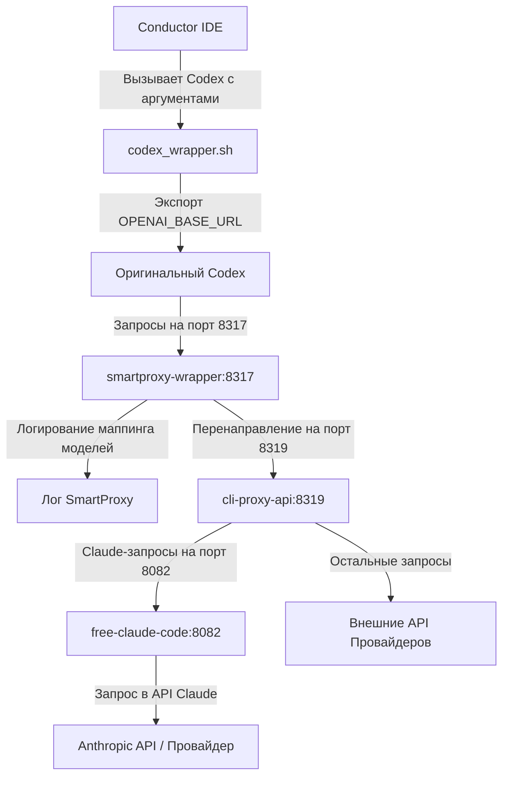

# Архитектура и взаимодействие компонентов

Проект **SmartProxy** представляет собой единый локальный стек проксирования для обеспечения беспрепятственной работы редактора Conductor с различными языковыми моделями (включая GPT-5.5, GPT-5.4 и Claude-Sonnet-4-6) в обход стандартных ограничений.

## 📡 Диаграмма потоков данных

Схема прохождения запроса:

---

## 📦 Описание компонентов стека

### 1. Conductor & codex_wrapper.sh
Conductor запускает фоновый процесс `codex` для взаимодействия с ИИ. Мы подменяем путь к исполняемому файлу на `codex_wrapper.sh`. Скрипт пробрасывает переменную окружения `OPENAI_BASE_URL="http://127.0.0.1:8317/v1"` и выполняет оригинальный бинарник Codex. 
Подробнее см. в [conductor.md](conductor.md).

### 2. SmartProxy (контейнер `smartproxy-wrapper`)
* **Порт**: `8317` (внутри Docker и хоста).
* **Скрипт**: `proxy_wrapper.js`.
* **Функция**: Локальная Node.js-прокси, перехватывающая HTTP-запросы Codex. Она читает входящие JSON-пакеты, определяет запрашиваемую модель, логирует её соответствие (например, маппинг на `gpt-5.4`), обновляет конфиг `proxy_config.json` и проксирует запросы на целевой `cli-proxy-api`.
* **Дополнение**: Перехватывает эндпоинты `/v1/chat/completions` и `/v1/responses` (для Codex Responses API).
* **Админка**: Доступна по адресу `http://localhost:8317/admin`.

### 3. CLI Proxy API (контейнер `cli-proxy-api`)
* **Порт**: `8319`.
* **Язык**: Go.
* **Функция**: Центральный маршрутизатор запросов. Отвечает за авторизацию (`CLIPROXY_API_KEY`) и роутинг моделей на внешние API или локальный прокси для Claude.

### 4. Claude Proxy (контейнер `free-claude-code`)
* **Порт**: `8082`.
* **Язык**: Python (Uvicorn / FastAPI).
* **Функция**: Обеспечивает проксирование для моделей семейства Claude (например, `claude-sonnet-4-6`), поддерживает режим рассуждений (`thinking`) и формирует совместимый с OpenAI формат ответов.
